# 🏗️ Lishop — Kiến trúc hệ thống

> **Công nghệ**: NestJS + PostgreSQL + Redis · Next.js 15 + Module Federation · Turborepo + pnpm

---

## 1. Tổng quan hệ thống (System Architecture)

```mermaid
flowchart TB
    subgraph FE["Frontend (Next.js 15 + Module Federation)"]
        SHELL["Shell (Port 3010)\nLayout, Header, Footer, AuthStore"]
        MFE_AUTH["MFE Auth (3001)\nLogin, Register, OAuth"]
        MFE_CATALOG["MFE Catalog (3002)\nProducts, Categories, Shops"]
        MFE_CART["MFE Cart (3003)\nCart Management"]
        MFE_CHECKOUT["MFE Checkout (3004)\nCheckout, Payment Simulator"]
        MFE_ORDERS["MFE Orders (3005)\nOrder History, Tracking"]
        MFE_PROFILE["MFE Profile (3006)\nProfile, Wallet, Wishlist"]
        MFE_PROMO["MFE Promotions (3007)\nCoupons, Flash Sales"]
        MFE_NOTIF["MFE Notifications (3008)\nIn-App, Preferences"]
        MFE_ADMIN["MFE Admin (3009)\nDashboard, Management"]
        MFE_SELLER["MFE Seller (3011)\nShop Dashboard"]
    end

    subgraph BE["Backend (NestJS — Port 4000)"]
        API["REST API\n(Fastify + Swagger)"]
        WS["WebSocket Gateway\n(Socket.IO)"]
        SSE["SSE Stream\n(Notifications)"]
        BULL["BullMQ Queue\n(Mail)"]
    end

    subgraph SERVICES["External Services & Infrastructure"]
        PG[("PostgreSQL 16\n(Docker port 5439)")]
        REDIS[("Redis 7\n(Docker port 6380)")]
        MEILI[("MeiliSearch\n(Docker port 7700)")]
        SMTP["SMTP (Email)"]
        OAUTH["Google / Facebook OAuth"]
        OPENAI["OpenAI API\n(gpt-5.2)"]
        UNSPLASH["Unsplash API"]
        PAYMENT_GW["VNPAY / MoMo / ZaloPay\nStripe / PayPal"]
        FCM["Firebase Cloud\nMessaging (FCM)"]
        S3[("AWS S3\n(Product Assets)")]
    end

    SHELL --> MFE_AUTH & MFE_CATALOG & MFE_CART & MFE_CHECKOUT
    SHELL --> MFE_ORDERS & MFE_PROFILE & MFE_PROMO
    SHELL --> MFE_NOTIF & MFE_ADMIN & MFE_SELLER

    MFE_AUTH --> API
    MFE_CATALOG --> API
    MFE_CART --> API
    MFE_CHECKOUT --> API
    MFE_ORDERS --> API
    MFE_PROFILE --> API
    MFE_PROMO --> API
    MFE_NOTIF --> SSE
    MFE_NOTIF --> API
    MFE_ADMIN --> API
    MFE_SELLER --> API

    API --> PG
    API --> REDIS
    API --> OAUTH
    API --> OPENAI
    API --> UNSPLASH
    API --> SMTP
    API --> PAYMENT_GW
    API --> FCM
    API --> S3
    WS --> REDIS
    BULL --> REDIS
    BULL --> SMTP
    MEILI --> PG
```

---

## 2. Backend Module Graph (NestJS)

```mermaid
flowchart TB
    subgraph MODULES["NestJS Application Modules"]
        CORE["ConfigModule\n(Global — Joi Validation)"]
        REDIS_MOD["RedisModule\n(Global)"]

        AUTH["AuthModule\nJWT, OAuth, Guards"]
        USERS["UsersModule"]
        ADDRESSES["AddressesModule"]
        SHOPS["ShopsModule"]
        CATEGORIES["CategoriesModule"]
        PRODUCTS["ProductsModule"]
        CART["CartModule"]
        ORDERS["OrdersModule"]
        PAYMENTS["PaymentsModule"]
        SHIPPING["ShippingModule"]
        REVIEWS["ReviewsModule"]
        RETURNS["ReturnsModule"]
        REFUNDS["RefundsModule"]
        INVOICES["InvoicesModule"]
        WALLET["WalletModule"]
        PROMOTIONS["PromotionsModule"]
        WISHLIST["WishlistModule"]
        INVENTORY["InventoryModule"]
        NOTIFICATIONS["NotificationsModule"]
        REALTIME["RealtimeModule\n(Socket.IO)"]
        SUPPORT["SupportModule"]
        SHOPPING["ShoppingModule\n(Concierge + Fit Advisor)"]
        ADMIN["AdminModule"]

        MAIL["MailModule\n(BullMQ Queue)"]
    end

    AUTH --> REDIS_MOD
    AUTH --> MAIL
    USERS --> AUTH
    ADDRESSES --> AUTH
    SHOPS --> AUTH
    SHOPS --> PRODUCTS
    PRODUCTS --> CATEGORIES
    PRODUCTS --> AUTH
    CART --> AUTH
    CART --> PROMOTIONS
    ORDERS --> AUTH
    ORDERS --> CART
    ORDERS --> ADDRESSES
    ORDERS --> INVENTORY
    PAYMENTS --> ORDERS
    SHIPPING --> ORDERS
    REVIEWS --> AUTH
    RETURNS --> ORDERS
    RETURNS --> REALTIME
    RETURNS --> NOTIFICATIONS
    RETURNS --> REFUNDS
    REFUNDS --> WALLET
    REFUNDS --> NOTIFICATIONS
    WALLET --> AUTH
    WALLET --> NOTIFICATIONS
    WALLET --> REALTIME
    PROMOTIONS --> REALTIME
    INVENTORY --> REALTIME
    NOTIFICATIONS --> REALTIME
    SUPPORT --> NOTIFICATIONS
    SUPPORT --> REALTIME
    SUPPORT --> PRODUCTS
    SUPPORT --> ORDERS
    SHOPPING --> PRODUCTS
    ADMIN --> AUTH
    ADMIN --> (Tất cả service modules)

    MAIL --> REDIS_MOD
```

---

## 3. Database Schema (Class Diagrams)

```mermaid
classDiagram

    class User {
        +String id
        +String email [unique]
        +String passwordHash
        +String firstName
        +String lastName
        +String avatarUrl
        +String role [CUSTOMER, ADMIN, SELLER]
        +Int loyaltyPoints
        +Boolean emailVerified
        +String googleId [unique]
        +String facebookId [unique]
        +DateTime createdAt
        +DateTime updatedAt
    }

    class DeviceToken {
        +String id
        +String userId
        +String token [unique]
        +String platform
    }

    class Shop {
        +String id
        +String name [unique]
        +String slug [unique]
        +String description
        +String logoUrl
        +String bannerUrl
        +String phone
        +String address
        +String status [PENDING, APPROVED, REJECTED]
        +String userId [unique]
        +DateTime approvedAt
        +String approvedById
        +String rejectionReason
    }

    class Address {
        +String id
        +String userId
        +String fullName
        +String phone
        +String street
        +String district
        +String city
        +String country
        +Float latitude
        +Float longitude
        +Boolean isDefault
    }

    class Category {
        +String id
        +String name
        +String slug [unique]
        +String imageUrl
        +String parentId
    }

    class Product {
        +String id
        +String name
        +String slug [unique]
        +String sku [unique]
        +String description
        +Int priceVnd
        +Int priceUsd
        +Int stock
        +Int weightGrams
        +String categoryId
        +String shopId
        +Float averageRating
        +Int reviewCount
    }

    class ProductImage {
        +String id
        +String productId
        +String url
        +String alt
        +Boolean isPrimary
    }

    class ProductVariant {
        +String id
        +String productId
        +String sku [unique]
        +String name
        +Int priceVnd
        +Int priceUsd
        +Int stock
        +Int weightGrams
        +Json attributes
        +String imageUrl
        +Boolean isDefault
        +Boolean isActive
    }

    class Tag {
        +String id
        +String name [unique]
    }

    class ProductTag {
        +String productId [composite PK]
        +String tagId [composite PK]
    }

    class CartItem {
        +String id
        +String userId
        +String productId
        +String variantId
        +Int quantity
    }

    class Wishlist {
        +String id
        +String userId
        +String productId
    }

    class Order {
        +String id
        +String orderNumber [unique]
        +String userId
        +String addressId
        +String status [PENDING, PROCESSING, SHIPPED, DELIVERED, CANCELLED, REFUNDED]
        +String shippingProvider [GHN, GHTK, VIETTEL_POST]
        +Int subtotalVnd
        +Int shippingFeeVnd
        +Int discountVnd
        +Int totalVnd
        +String notes
        +String trackingNumber
        +DateTime createdAt
    }

    class OrderItem {
        +String id
        +String orderId
        +String productId
        +String variantId
        +String shopId
        +String productName [snapshot]
        +String variantName [snapshot]
        +String variantSku [snapshot]
        +Json variantAttributes [snapshot]
        +Int quantity
        +Int unitPriceVnd
        +Int totalPriceVnd
    }

    class StockMovement {
        +String id
        +String productId
        +String type [ORDER_PLACED, ORDER_CANCELLED, RETURN_COMPLETED, ADMIN_ADJUSTMENT]
        +Int delta
        +Int balanceAfter
        +String referenceId
        +String note
    }

    class Payment {
        +String id
        +String orderId [unique]
        +String method [STRIPE, PAYPAL, VNPAY, MOMO, ZALOPAY, WALLET, COD]
        +Int amountVnd
        +String status [PENDING, COMPLETED, FAILED, REFUNDED]
        +String providerRef
        +String invoiceUrl
    }

    class Shipment {
        +String id
        +String orderId [unique]
        +String provider
        +String trackingNumber
        +DateTime estimatedAt
        +DateTime shippedAt
        +DateTime deliveredAt
    }

    class ShipmentEvent {
        +String id
        +String shipmentId
        +String status
        +String location
        +String description
        +DateTime createdAt
    }

    class Review {
        +String id
        +String productId
        +String userId
        +Int rating
        +String content
        +String status [PENDING, APPROVED, REJECTED]
        +Boolean verifiedPurchase
    }

    class ReturnRequest {
        +String id
        +String orderId [unique]
        +String userId
        +String status [PENDING, APPROVED, REJECTED, RECEIVED, COMPLETED]
        +String reason [DAMAGED, WRONG_ITEM, NOT_AS_DESCRIBED, CHANGED_MIND, OTHER]
        +String description
        +String adminNote
    }

    class ReturnItem {
        +String id
        +String returnRequestId
        +String orderItemId
        +Int quantity
    }

    class Refund {
        +String id
        +String orderId
        +String returnId [unique]
        +String userId
        +Int amountVnd
        +String method [ORIGINAL_PAYMENT, WALLET, MANUAL]
        +String status [PENDING, PROCESSING, COMPLETED, FAILED]
        +String reason
        +String adminNote
        +DateTime processedAt
    }

    class Wallet {
        +String id
        +String userId [unique]
        +Int balanceVnd
    }

    class WalletTransaction {
        +String id
        +String walletId
        +String type [TOPUP, PAYMENT, REFUND, WITHDRAW, POINTS_CONVERSION]
        +Int amountVnd
        +Int balanceAfter
        +String description
        +String referenceId
    }

    class WalletTopupRequest {
        +String id
        +String userId
        +String walletId
        +Int amountVnd
        +String status [PENDING, APPROVED, REJECTED]
        +String transferCode [unique]
        +String bankName
        +String bankAccountNumber
        +String bankAccountName
        +String adminNote
        +String reviewedById
        +DateTime reviewedAt
    }

    class Coupon {
        +String id
        +String code [unique]
        +String type [PERCENT, FIXED, FREE_SHIPPING]
        +Int value
        +Int minOrderVnd
        +Int maxUses
        +Int usedCount
        +DateTime expiresAt
        +Boolean isActive
    }

    class CouponUsage {
        +String id
        +String couponId
        +String userId
    }

    class FlashSale {
        +String id
        +DateTime startAt
        +DateTime endAt
        +Boolean isActive
    }

    class FlashSaleItem {
        +String id
        +String flashSaleId
        +String productId
        +Int discountPercent
    }

    class SupportTicket {
        +String id
        +String userId
        +String orderRef
        +String category [ORDER, PRODUCT, SHIPPING, PAYMENT, RETURN, OTHER]
        +String subject
        +String status [OPEN, IN_PROGRESS, RESOLVED, CLOSED]
    }

    class TicketMessage {
        +String id
        +String ticketId
        +String userId
        +Boolean isAdmin
        +String content
    }

    class FAQ {
        +String id
        +String question
        +String answer
        +String category
        +Int sortOrder
        +Boolean isPublished
    }

    class Notification {
        +String id
        +String userId
        +String title
        +String body
        +String type
        +String relatedId
        +Boolean isRead
    }

    class NotificationPreference {
        +String id
        +String userId
        +String eventType
        +Boolean emailEnabled
        +Boolean pushEnabled
        +Boolean inAppEnabled
    }

    class Invoice {
        +String id
        +String orderId [unique]
        +String userId
        +String invoiceNo [unique]
        +String billingName
        +String billingEmail
        +String billingAddress
        +String billingPhone
        +Int subtotalVnd
        +Int discountVnd
        +Int shippingFeeVnd
        +Int vatPercent
        +Int vatVnd
        +Int totalVnd
    }

    class LoyaltyPoint {
        +String id
        +String userId
        +Int points
        +String description
    }

    User "1" --> "*" Address : has
    User "1" --> "*" Order : places
    User "1" --> "*" Review : writes
    User "1" --> "*" CartItem : owns
    User "1" --> "*" Wishlist : has
    User "1" --> "*" Notification : receives
    User "1" --> "*" DeviceToken : registers
    User "1" --> "*" NotificationPreference : configures
    User "1" --> "*" LoyaltyPoint : earns
    User "1" --> "*" CouponUsage : uses
    User "1" --> "*" ReturnRequest : requests
    User "1" --> "*" SupportTicket : creates
    User "1" --> "*" TicketMessage : sends
    User "1" --> "1" Wallet : has
    User "1" --> "*" WalletTopupRequest : submits
    User "1" --> "*" Invoice : receives
    User "1" --> "*" Refund : gets
    User "1" --> "0..1" Shop : owns
    User "1" --> "*" Shop : approves

    Shop "1" --> "*" Product : sells
    Shop "1" --> "*" OrderItem : fulfills

    Category "1" --> "*" Category : has_child
    Category "1" --> "*" Product : contains

    Product "1" --> "*" ProductImage : has
    Product "1" --> "*" ProductVariant : has
    Product "1" --> "*" ProductTag : tagged
    Product "1" --> "*" Tag : tagged_via
    Product "1" --> "*" Review : receives
    Product "1" --> "*" CartItem : in_carts
    Product "1" --> "*" OrderItem : ordered
    Product "1" --> "*" Wishlist : wished
    Product "1" --> "*" StockMovement : tracks
    Product "1" --> "*" FlashSaleItem : discounted

    Order "1" --> "*" OrderItem : contains
    Order "1" --> "1" Payment : has
    Order "1" --> "1" Shipment : ships
    Order "1" --> "0..1" ReturnRequest : returns
    Order "1" --> "1" Invoice : billed
    Order "1" --> "*" Refund : refunded
    Order "1" --> "1" Address : delivered_to

    Shipment "1" --> "*" ShipmentEvent : tracks

    ReturnRequest "1" --> "*" ReturnItem : includes
    ReturnRequest "0..1" --> "0..1" Refund : refunds

    Wallet "1" --> "*" WalletTransaction : logs
    Wallet "1" --> "*" WalletTopupRequest : topups

    Coupon "1" --> "*" CouponUsage : used

    FlashSale "1" --> "*" FlashSaleItem : includes

    SupportTicket "1" --> "*" TicketMessage : contains
```

### 🔗 Relationship Map (Tóm tắt)

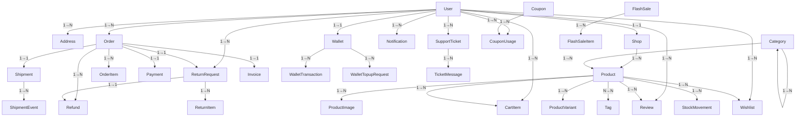

---

## 4. Micro-Frontend Architecture (Module Federation)

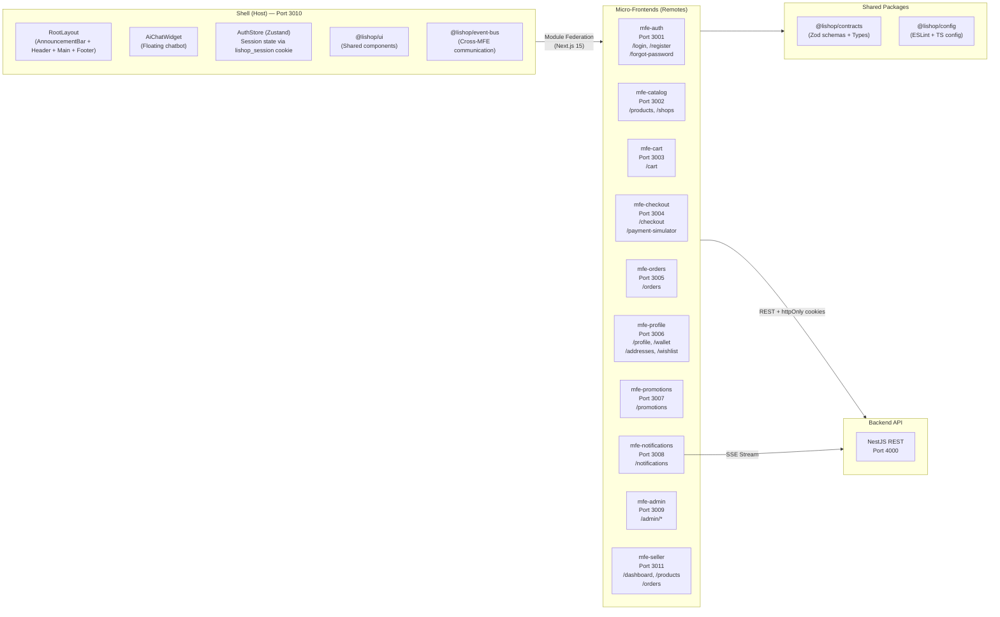

---

## 5. Authentication Flow

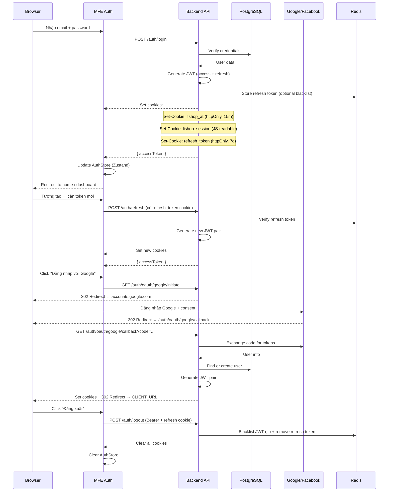

---

## 6. Payment Flow

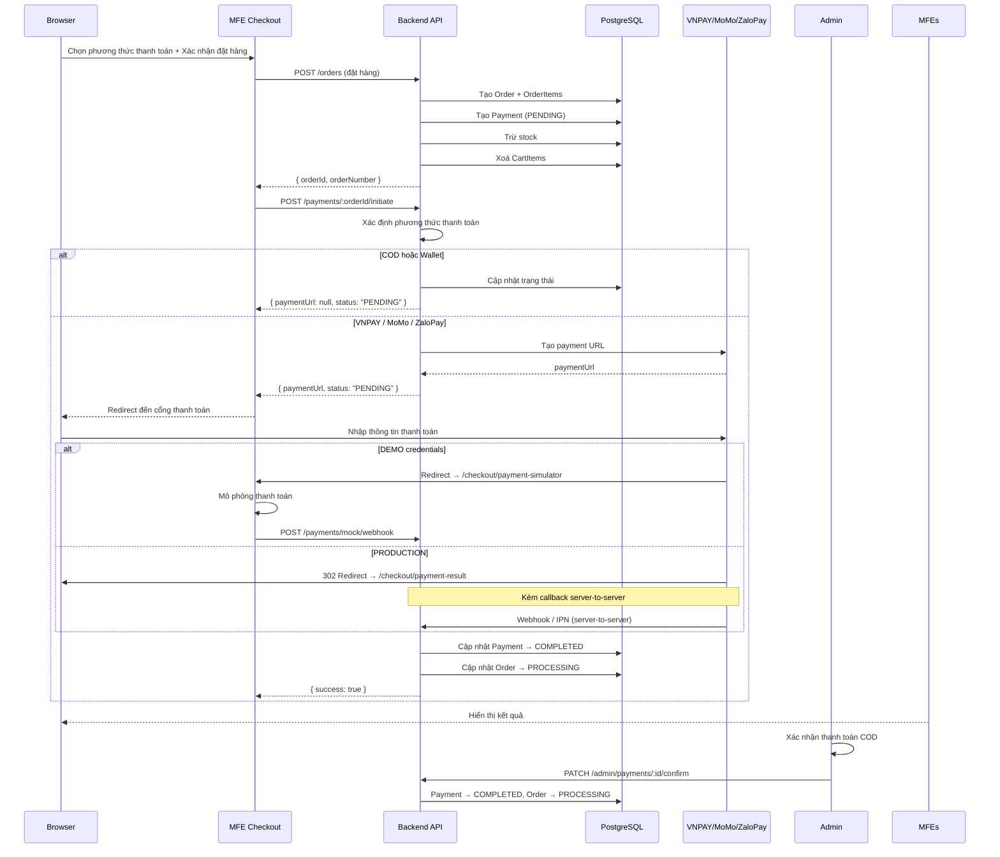

---

## 7. AI Features Architecture

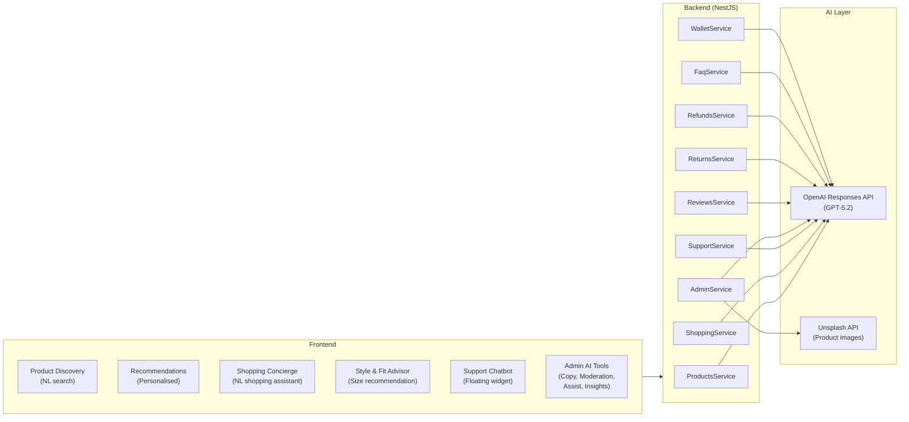

---

## 8. Docker Infrastructure

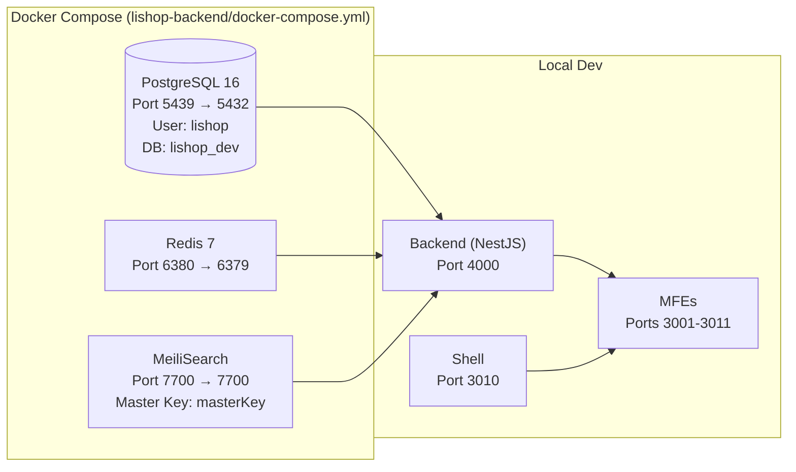

---

## 9. Tech Stack Overview

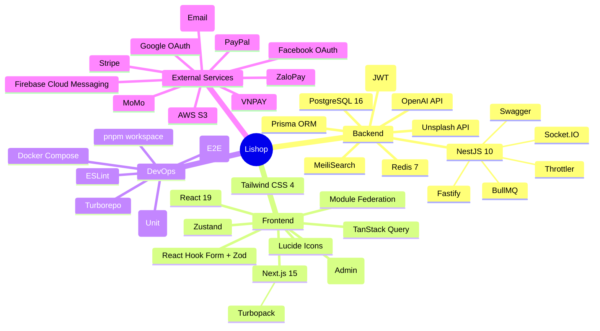

---

---

## 10. Data Flow — Đặt hàng & Thanh toán (Order → Payment → Shipment)

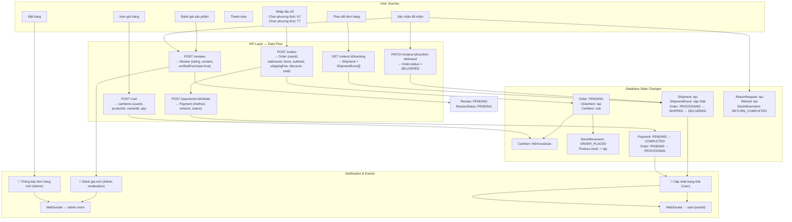

---

## 11. Data Flow — Duyệt & Tìm kiếm sản phẩm (Product Catalog)

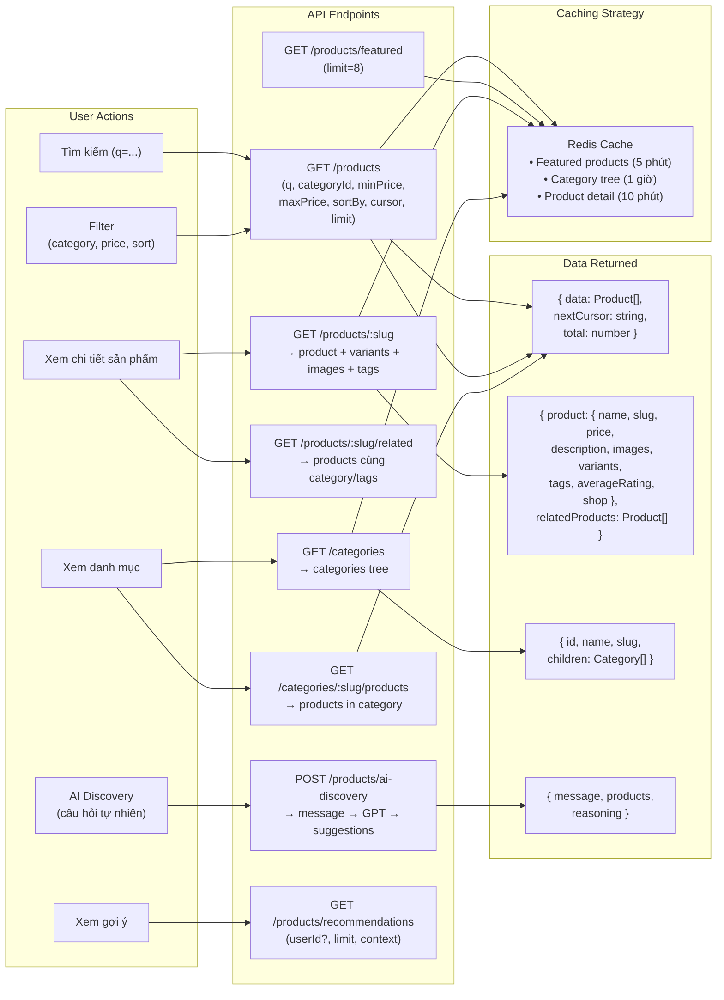

---

## 12. Data Flow — Xác thực & Phiên làm việc (Auth & Session)

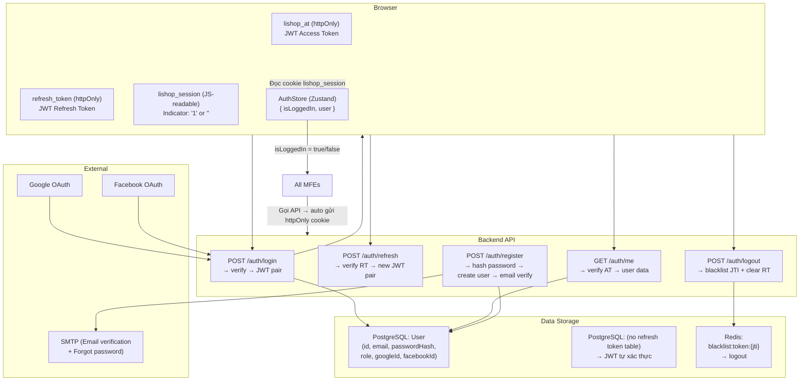

---

## 13. Data Flow — Thông báo (Notification System)

```mermaid

```

---

## 14. Data Flow — Admin Operations

```mermaid

```

---

## 15. Data Flow — Ví & Hoàn tiền (Wallet & Refund)

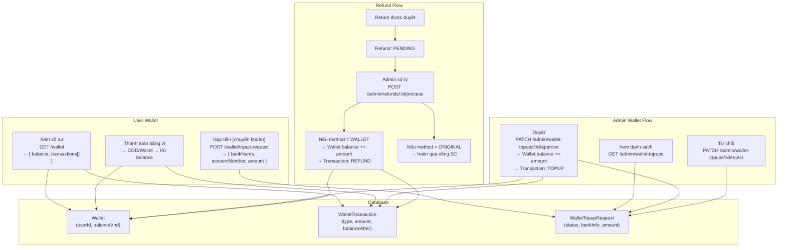

---

## 16. Data Model — Product Domain (Chi tiết)

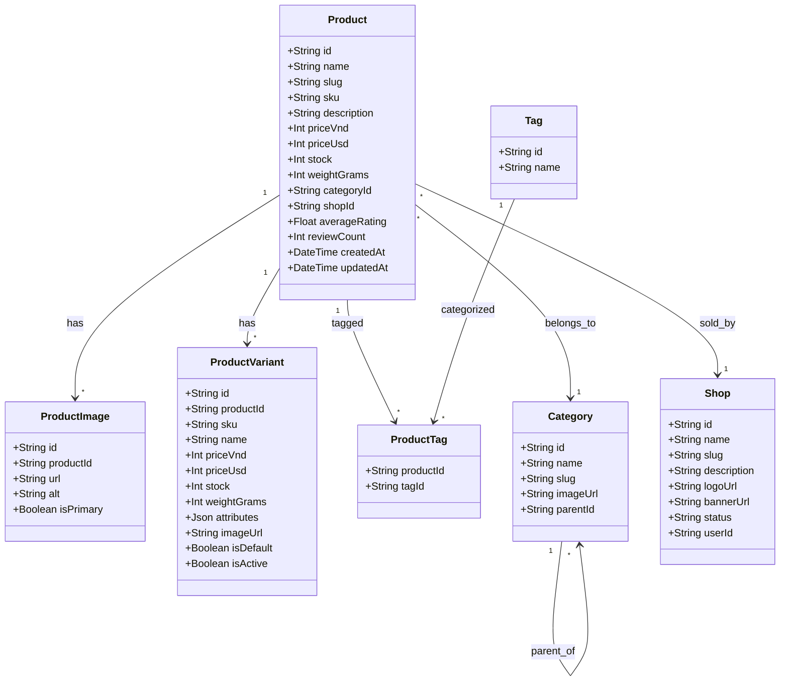

---

## 17. Data Model — Order & Payment Domain (Chi tiết)

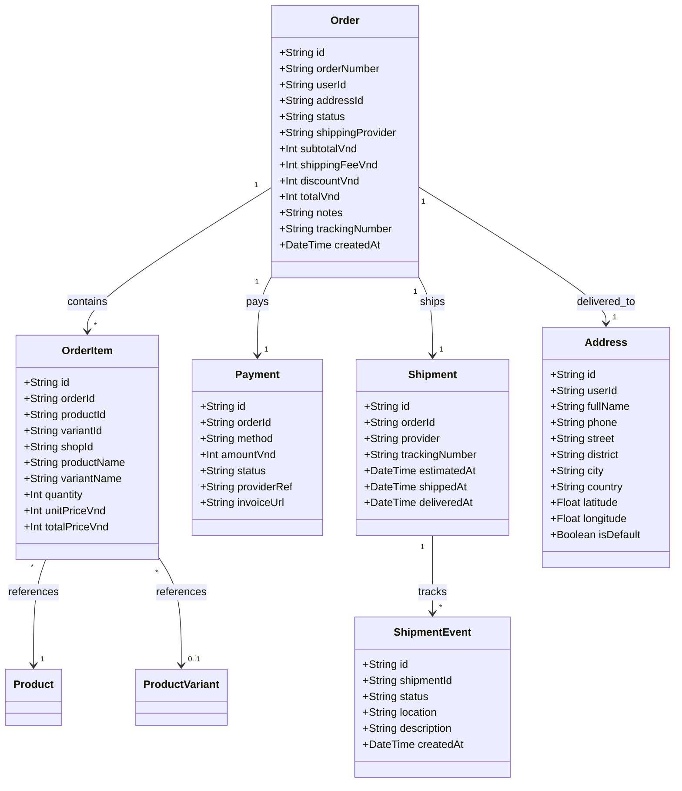

---

## 18. Data Model — Support & Review Domain

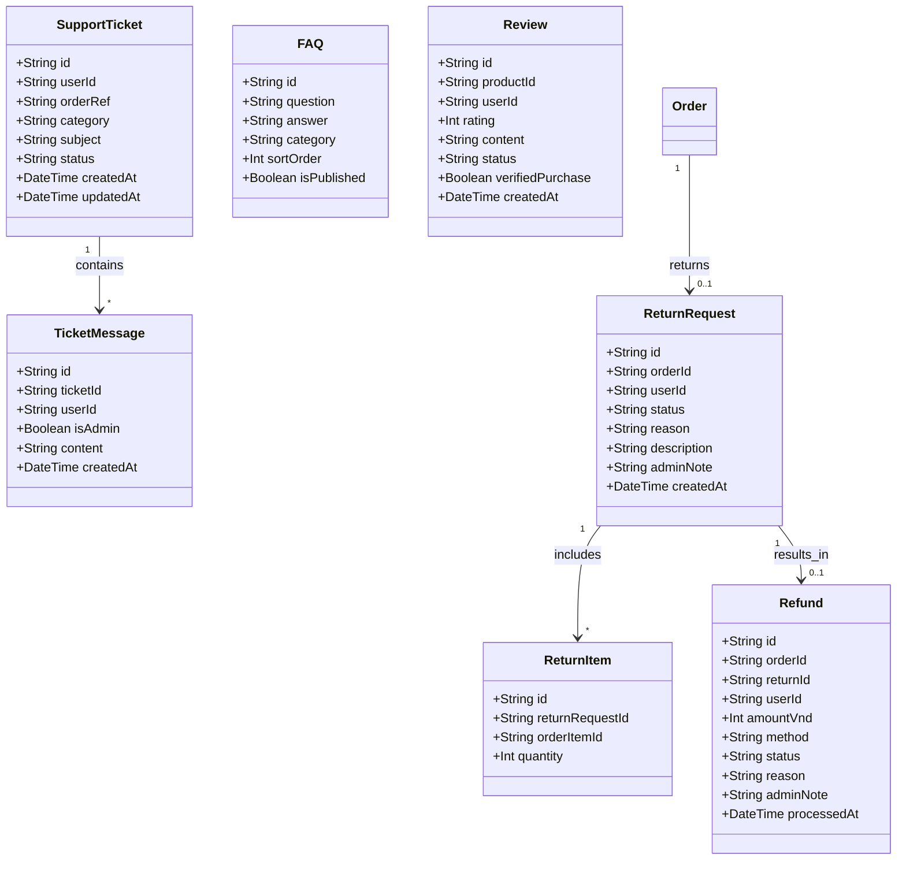

---

## 19. State Management — Frontend Data Flow

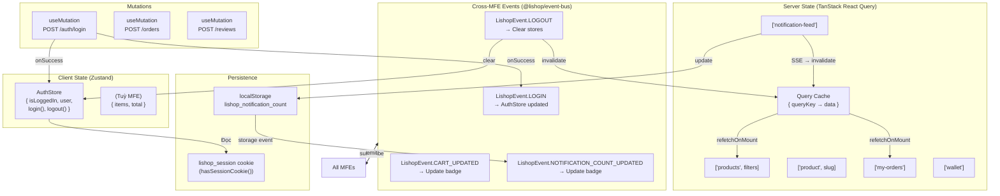

---

## 20. Data Migration & Seed Flow

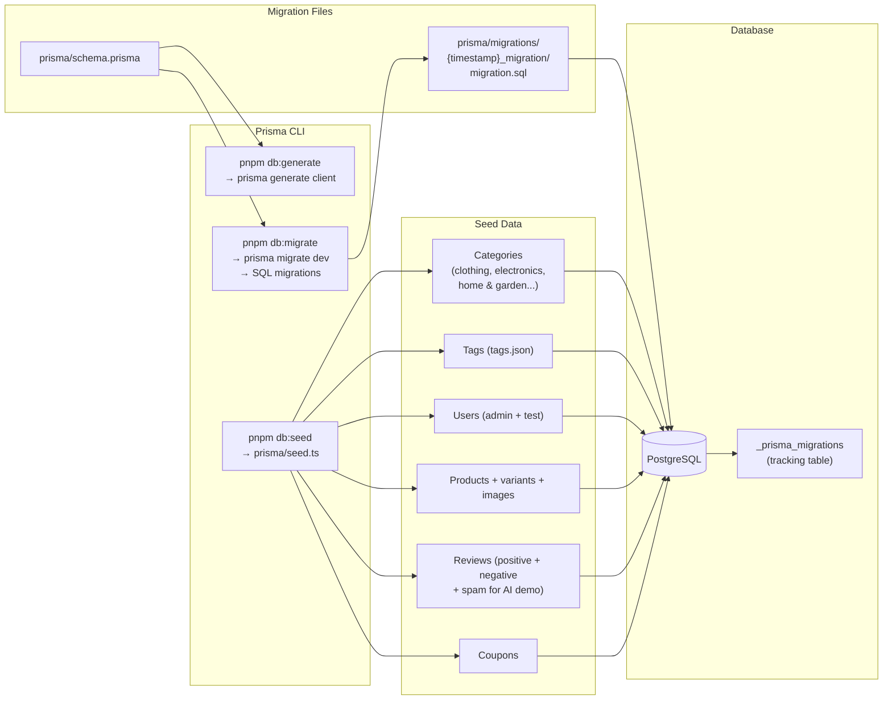

---

*Tạo bởi Mermaid — render trên GitHub, GitLab, hoặc dùng [Mermaid Live Editor](https://mermaid.live/edit) để xem trước.*
